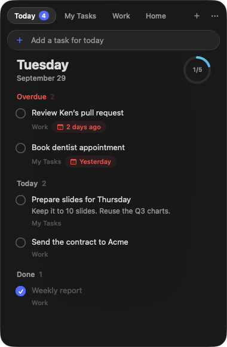
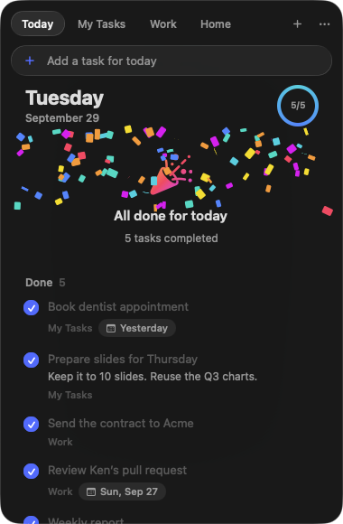
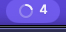
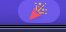

# Dueday

[](https://github.com/tachibanayu24/dueday/actions/workflows/build.yml)
[](LICENSE)


Google Tasks in your menu bar. Dueday counts what's due today and what's overdue, fills a ring as you get through it, and throws confetti when the day is done.

<p align="center">
  
  &nbsp;&nbsp;
  
</p>

## Features

- **A glance is enough.** The menu bar shows how many tasks are due today or overdue, across every list, with a ring that fills as you complete them . When nothing is left, it turns into a party popper .
- **Today, across lists.** Click it for one view of what's overdue, what's due today and what you've already done, with the list each task belongs to.
- **Every list, too.** Each list is a tab: add, edit, complete, reorder by dragging, nest subtasks, set dates, move tasks between lists, create and rename lists.
- **Instant.** Edits show immediately and sync in the background, in order. Changes made on your phone show up within seconds while the panel is open and within minutes otherwise.
- **Liquid Glass.** A glass panel that drops from the menu bar, from crystal clear to tinted.
- **Your own keys, no server.** Dueday talks to Google directly with an OAuth client you create. Nothing passes through anyone else.

### What it doesn't do

Dueday only does what the [Google Tasks API](https://developers.google.com/workspace/tasks/reference/rest) allows. The API can't read or set a task's **time** (dates only), **repeat** rules, **stars**, or **reminders**, and can't reorder lists — so Dueday doesn't either. Tasks with those still show up; edit those details in Google Tasks itself (every task has *Open in Google Tasks*).

## Setup

Dueday ships without any Google credentials: you use your own OAuth client, which takes about five minutes once.

1. **Create a project** in the [Google Cloud console](https://console.cloud.google.com/projectcreate) (any name).
2. **Enable the API:** [Google Tasks API](https://console.cloud.google.com/apis/library/tasks.googleapis.com) → *Enable*.
3. **Consent screen:** open [Google Auth Platform → Branding](https://console.cloud.google.com/auth/branding), *Get started*, choose **External**, fill in an app name and your email.
4. **Publish it:** [Audience](https://console.cloud.google.com/auth/audience) → **Publish app** → *Confirm*.
   While a project is in *Testing*, Google expires sign-ins after 7 days. Publishing does not make anything public, and there's no review to wait for when only you use it.
5. **Create the client:** [Clients](https://console.cloud.google.com/auth/clients) → *Create client* → Application type **Desktop app** → *Create*. Copy the **Client ID** and **Client secret**.
6. **Sign in:** click Dueday in the menu bar, paste both, and press *Sign in with Google*.
   Google will say the app isn't verified — it's your own app, so choose *Advanced* → *Go to …* and allow access to Google Tasks.

The client and the sign-in are stored in your login keychain. The only scope requested is `https://www.googleapis.com/auth/tasks`.

## Install

Requires macOS 26 or later and Xcode 26 (Swift 6.2) to build.

```sh
git clone https://github.com/tachibanayu24/dueday.git
cd dueday
./scripts/build-app.sh --install   # builds, copies to /Applications and launches
```

Dueday lives in the menu bar (no Dock icon). It is ad-hoc signed, so build it on the Mac that runs it. After rebuilding, macOS may ask once whether Dueday may use its keychain item — choose *Always Allow*.

## Usage

| | |
|---|---|
| Click the menu bar item | Open / close (clicking elsewhere or `Esc` closes it too) |
| Right-click | Refresh, Open Google Tasks, Settings, Quit |
| `⌘N` | New task (in Today: due today, in your first list) |
| `⌘⌥0`, `⌘1`…`⌘9` | Today, a list (`⌘9` = last) |
| `⌃Tab` / `⌃⇧Tab`, `⌘⇧]` / `⌘⇧[` | Next / previous tab |
| `⌘R` | Refresh |
| `⌘+` `⌘-` `⌘0` | Text size |
| `⌘,` | Settings |
| `⌘Q` twice | Quit (a single press only shows a hint) |

On a task: click the circle to complete it, click the title to edit it, click the row for details, notes, date and actions, and right-click for more (subtasks, move to another list, postpone to tomorrow, delete). Drag tasks to reorder them; drop one under another task's subtasks to make it a subtask.

**Settings** (`⌘,`): account, an optional global shortcut, theme, opacity, text size, launch at login.

## How it works

| | |
|---|---|
| `GoogleAuth` | Installed-app OAuth: a one-shot server on `127.0.0.1` receives the redirect, with PKCE; refresh tokens in the keychain |
| `TasksAPI` | Thin async client for Tasks API v1 |
| `TaskStore` | Local mirror of all lists. Edits apply locally first, then go to Google through one serial queue; once it drains, touched lists are re-read and the server's order and ids win. Fetches that raced a local edit are dropped. |
| `PanelController` | Menu bar item (count, progress ring, party popper) and the non-activating glass panel it opens |
| `TodayView`, `TaskListView`, `ListTabBar` | The SwiftUI views |

The menu bar count is kept fresh every 5 minutes, after waking from sleep, and at midnight; while the panel is open, every 30 seconds. The last synced state is cached (`~/Library/Application Support/com.tachibanayu24.Dueday/cache.json`, readable only by you) so the count is right the moment Dueday starts.

`Vendor/` holds [KeyboardShortcuts](https://github.com/sindresorhus/KeyboardShortcuts), patched to compile its English strings in, so the app needs no SwiftPM resource bundle (SwiftPM's generated lookup can't find one inside a signed app).

## Development

```sh
swift build                        # compile
./scripts/build-app.sh             # build/Dueday.app
./scripts/build-app.sh --dev       # "Dueday Dev.app": its own bundle id, settings and account
swift scripts/make-icon.swift      # regenerate the icon
```

The dev app never takes the keyboard on its own. It listens for distributed notifications, so it can be driven without touching the keyboard or mouse:

| Notification | Effect |
|---|---|
| `DuedayDev.demo` | Load sample lists and tasks (edits stay local, nothing is sent to Google) |
| `DuedayDev.preview` | Open the panel without taking the keyboard |
| `DuedayDev.toggle` | Open / close the panel |
| `DuedayDev.finish` | Complete everything due today (to see the celebration) |
| `DuedayDev.next` | Next tab |
| `DuedayDev.settings` | Open Settings |

See [CONTRIBUTING.md](CONTRIBUTING.md).

## License

[MIT](LICENSE). [KeyboardShortcuts](Vendor/KeyboardShortcuts/license) (MIT) keeps its own license.
