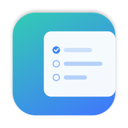
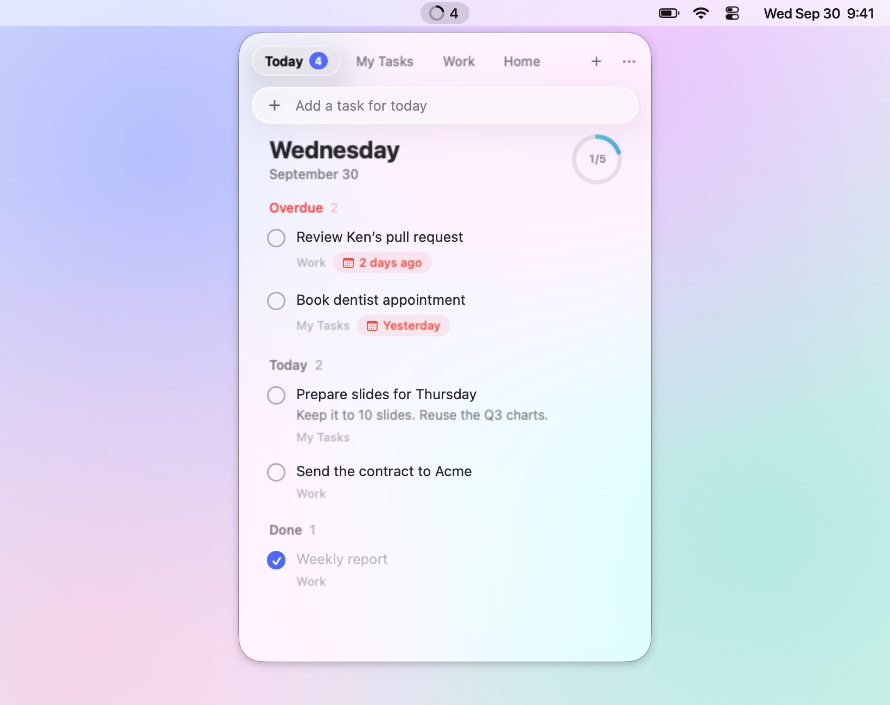
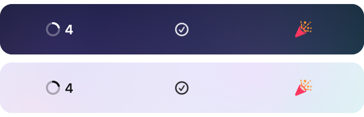
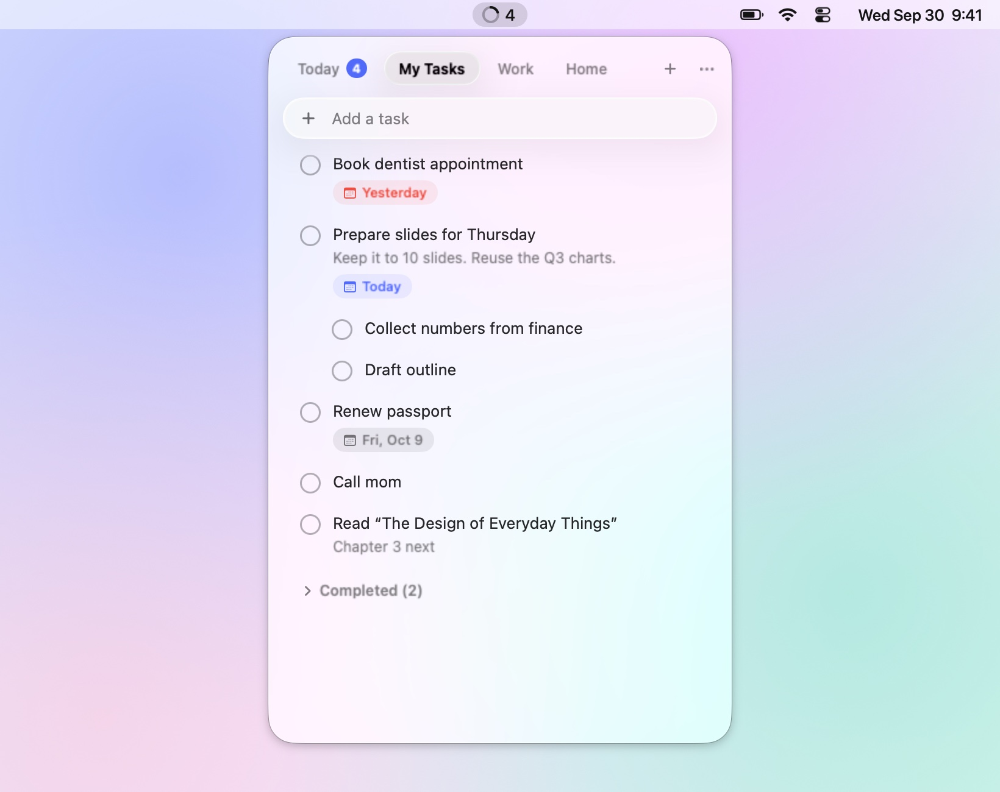
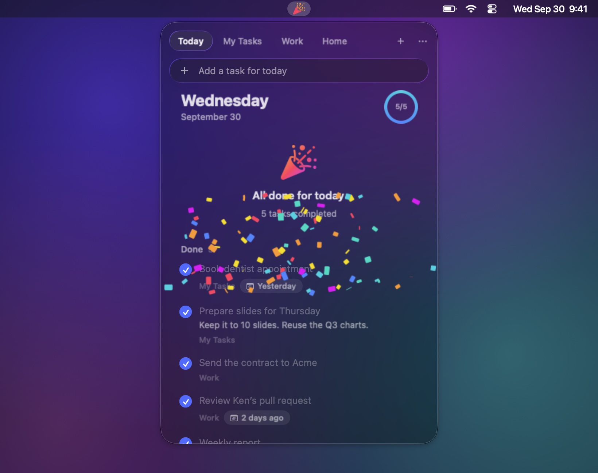

<p align="center">
  
</p>

<h1 align="center">Google Tasks Client</h1>

<p align="center">
  <strong>Google Tasks in your Mac's menu bar.</strong><br>
  See what's due at a glance, get through it, and enjoy the confetti.
</p>

<p align="center">
  <a href="https://github.com/tachibanayu24/google-tasks-client/actions/workflows/build.yml"></a>
  <a href="LICENSE"></a>
  
  
</p>

<p align="center">
  <picture>
    <source media="(prefers-color-scheme: dark)" srcset="docs/hero-dark.jpg">
    
  </picture>
</p>

## Features

- **A glance is enough.** The menu bar shows how many tasks are due today or overdue, across every list, next to a ring that fills as you complete them. Nothing due shows a calm check mark. Once everything is done, it turns into a party popper.

  

- **Today, across lists.** Open it for one view of what's overdue, what's due today and what you've already done, each with the list it belongs to. Postpone to tomorrow with a right-click.
- **Every list, too.** Each list is a tab. Add, edit and complete tasks. Drag to reorder, nest subtasks, set dates, write notes, move tasks between lists, and create or rename lists.
- **Instant.** Edits show immediately and sync in the background, in order. Changes made elsewhere arrive within half a minute while the panel is open, and within five minutes in the menu bar.
- **Liquid Glass**, in light and dark, from crystal clear to tinted.
- **Your keys, your data.** It talks to Google directly with an OAuth client you create. There's no server in between and no telemetry.

<p align="center">
  
  
</p>

### What it doesn't do

It does only what the [Google Tasks API](https://developers.google.com/workspace/tasks/reference/rest) allows. The API can't read or set a task's **time** (dates only), **repeat** rules, **stars** or **reminders**, and it can't reorder lists, so neither can this app. Tasks with those still show up. To edit those details, use Google Tasks itself (every task has *Open in Google Tasks*).

## Install

Requires macOS 26 (Tahoe) or later, and Xcode 26 (Swift 6.2) to build.

```sh
git clone https://github.com/tachibanayu24/google-tasks-client.git
cd google-tasks-client
./scripts/build-app.sh --install   # builds, copies to /Applications and launches
```

The app lives in the menu bar, with no Dock icon. It is ad-hoc signed, so build it on the Mac that runs it.

## Connect your Google account

The app ships without any Google credentials. You use your own OAuth client, which takes about five minutes to set up once. The panel shows these steps too, with links.

1. **Create a project** in the [Google Cloud console](https://console.cloud.google.com/projectcreate) (any name).
2. **Enable the API:** open [Google Tasks API](https://console.cloud.google.com/apis/library/tasks.googleapis.com) and click *Enable*.
3. **Set up the consent screen:** open [Google Auth Platform → Branding](https://console.cloud.google.com/auth/branding) and click *Get started*.
   - Choose **External** and fill in an app name and your email.
   - The app name can't contain "Google". Something like *My Tasks* works.
4. **Publish it:** open [Audience](https://console.cloud.google.com/auth/audience) and click **Publish app** → *Confirm*.
   - While a project is in *Testing*, Google ends sign-ins after 7 days.
   - Publishing doesn't make anything public. There's no review to wait for when only you use it.
5. **Create the client:** open [Clients](https://console.cloud.google.com/auth/clients), click *Create client*, choose Application type **Desktop app**, and click *Create*. Copy the **Client ID** and **Client secret**.
6. **Sign in:** click the menu bar item, paste both, and press *Sign in with Google*.
   - Google warns that the app isn't verified. It's your own app, so choose *Advanced* → *Go to …* and allow access to Google Tasks.

## Usage

| | |
|---|---|
| Click the menu bar item | Open or close the panel (clicking elsewhere, `Esc` or switching apps closes it too) |
| Right-click the menu bar item | Refresh, Open Google Tasks, Settings, Quit |
| `⌘N` | New task (from Today: due today, in your first list) |
| `⌘⌥0`, `⌘1`…`⌘9` | Today, a list (`⌘9` = the last one) |
| `⌃Tab` / `⌃⇧Tab`, `⌘⇧]` / `⌘⇧[` | Next / previous tab |
| `⌘R` | Refresh |
| `⌘+` `⌘-` `⌘0` | Text size |
| `⌘,` | Settings |
| `⌘Q` twice | Quit (a single press only shows a hint) |

**On a task**

- Click the circle to complete it (click again right away to take it back).
- Click the title to rename it.
- Click the row for notes, the date and more actions.
- Right-click for subtasks, *Move to* another list, *Postpone to Tomorrow*, *Open in Google Tasks* and *Delete*.
- Drag to reorder. Dragging a subtask under another task moves it there, and *Make Subtask* nests a task under the one above it.

**Settings:** your account, an optional global shortcut, theme, opacity, text size and launch at login.

## Privacy

- **Network:** the app talks only to Google: `accounts.google.com` and `oauth2.googleapis.com` to sign in, and `tasks.googleapis.com` for your tasks. There is no analytics or telemetry, and no server of ours.
- **Permissions:** it requests a single scope, `https://www.googleapis.com/auth/tasks`, to read and edit your tasks.
- **On disk:**
  - Your OAuth client and refresh token are in your login keychain.
  - A cache of your lists is in `~/Library/Application Support/com.tachibanayu24.GoogleTasksClient/cache.json`, readable only by your user. It is removed when you sign out.
  - Settings are kept in the app's preferences.
- **Signing out** (Settings) revokes the token at Google.

## Troubleshooting

<details>
<summary><strong>"Access blocked: … has not completed the Google verification process"</strong></summary>

The consent screen is still in *Testing*, and your account isn't listed as a test user. [Publish the app](https://console.cloud.google.com/auth/audience) (step 4).
</details>

<details>
<summary><strong>Signed out after about a week</strong></summary>

Google expires sign-ins of projects in *Testing* after 7 days. [Publish the app](https://console.cloud.google.com/auth/audience), then sign in again.
</details>

<details>
<summary><strong>"Error 400: redirect_uri_mismatch" or "invalid_client"</strong></summary>

The client must be of type **Desktop app**, not *Web application*. Create a new one (step 5) and paste its ID and secret.
</details>

<details>
<summary><strong>macOS asks for keychain access after an update</strong></summary>

Each build is signed anew, so macOS asks once whether the new build may read the saved sign-in. Choose *Always Allow*.
</details>

<details>
<summary><strong>The count differs from what I see in Google Tasks</strong></summary>

The menu bar counts open tasks **with a date of today or earlier**, in all lists. Tasks without a date aren't counted.
</details>

## How it works

| | |
|---|---|
| [`GoogleAuth`](Sources/GoogleTasksClient/GoogleAuth.swift) | Installed-app OAuth with PKCE. A one-shot server on `127.0.0.1` receives the redirect, and refresh tokens are kept in the keychain. |
| [`TasksAPI`](Sources/GoogleTasksClient/TasksAPI.swift) | A thin async client for Tasks API v1 |
| [`TaskStore`](Sources/GoogleTasksClient/TaskStore.swift) | The local mirror of all lists (details below) |
| [`PanelController`](Sources/GoogleTasksClient/PanelController.swift) | The menu bar item and the non-activating glass panel it opens |
| [`TodayView`](Sources/GoogleTasksClient/TodayView.swift), [`TaskListView`](Sources/GoogleTasksClient/TaskListView.swift), [`ListTabBar`](Sources/GoogleTasksClient/ListTabBar.swift) | The SwiftUI views |

**`TaskStore`**

- Edits apply locally first, then go to Google through one serial queue.
- Once the queue drains, the lists it touched are re-read, and the server's order and ids take over.
- A fetch that overlapped a local edit or a write is dropped, so a sync can never undo what you just did.

The menu bar count is refreshed every 5 minutes, after waking from sleep and at midnight, and every 30 seconds while the panel is open.

To keep the glass looking the same whether or not the panel has focus, the panel answers a few private AppKit appearance hooks. That keeps it out of the Mac App Store, and a future macOS update could change how they behave.

`Vendor/` holds [KeyboardShortcuts](https://github.com/sindresorhus/KeyboardShortcuts), patched to compile its English strings in. That way the app needs no SwiftPM resource bundle, which SwiftPM's generated lookup can't find inside a signed app.

## Development

```sh
swift build                        # compile
swift test                         # store, sync and sign-in tests against an in-memory Google Tasks
./scripts/build-app.sh --dev       # "Google Tasks Client Dev.app": its own bundle id, settings and account
./scripts/docs/capture.sh          # regenerate the images in docs/ (sample data, no account needed)
swift scripts/make-icon.swift      # regenerate the icon
```

The dev app never takes the keyboard on its own. It can be driven with distributed notifications, without touching the keyboard or mouse:

| Notification | Effect |
|---|---|
| `GoogleTasksClientDev.demo` | Load sample lists and tasks (edits stay local; nothing is sent to Google) |
| `GoogleTasksClientDev.preview` | Open the panel without taking the keyboard |
| `GoogleTasksClientDev.toggle` | Open or close the panel |
| `GoogleTasksClientDev.next` | Next tab |
| `GoogleTasksClientDev.finish` | Complete everything due today (to see the celebration) |
| `GoogleTasksClientDev.settings` | Open Settings |
| `GoogleTasksClientDev.zoom` | Show the panel at twice its size, for Retina-quality captures on any display |

Contributions are welcome. See [CONTRIBUTING.md](CONTRIBUTING.md).

## License

[MIT](LICENSE). The vendored [KeyboardShortcuts](Vendor/KeyboardShortcuts/license) (MIT) keeps its own license.

This is an independent project, not affiliated with or endorsed by Google. Google Tasks is a trademark of Google LLC.
